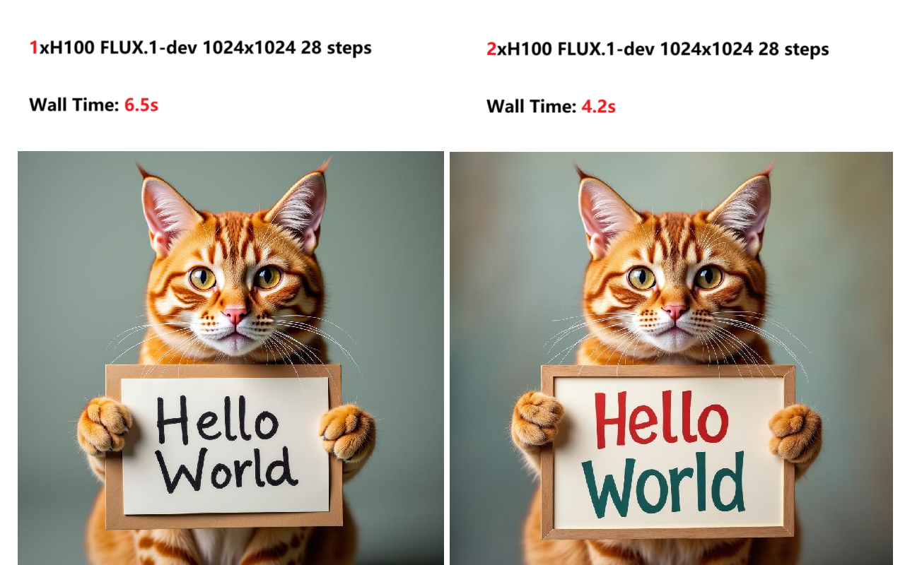

# PIFLUX

Parallel inference for `black-forest-labs`' [`FLUX`](https://huggingface.co/black-forest-labs/FLUX.1-dev) model.

## Description

`piflux` is a parallel inference optimization library for `black-forest-labs`' [`FLUX`](https://huggingface.co/black-forest-labs/FLUX.1-dev) model. It works with `torch.distributed` to utilize more than 1 NVIDIA GPU to parallelize the inference. So that the time needed for generating one image can be reduced more.

This library is only for demonstrative perpose and is not intended for production use. Whether it can be combined with other optimization techniques like `torch.compile` is not tested.

## Installation

```bash
git clone https://github.com/chengzeyi/piflux.git
cd piflux
git submodule update --init --recursive

pip3 install packaging wheel 'setuptools>=64,<70' 'setuptools_scm>=8'

pip3 install -e '.[dev]'

# Code formatting and linting
pip3 install pre-commit
pre-commit install
pre-commit run --all-files
```

## Usage

### Run the example

```bash
N_GPUS=2
torchrun --nproc_per_node=$N_GPUS examples/run_flux.py --print-output
```

## How it works

`piflux` replicates the model on each GPU that it uses. Its working state is partitioned into two parts:

1. During the first inference step, the input latent is divided into N parts, where N is the number of GPUs. Each part is sent to a different GPU. The model is then run on each GPU with its corresponding input part. When `torch.nn.functional.scaled_dot_product_attention` is called, we call all `gather` to get the full KV and store them into a cache. The output noise prediction is then collected and concatenated to form the final output.
2. In the remaining inference steps, we don't need to call `gather` to get the full KV. Instead, we circle through the the input latent parts and assign them to different GPUs. Therefore, when `torch.nn.functional.scaled_dot_product_attention` is called, we can use the cached KV from the previous steps and update different parts of the cached KV periodically. The output noise prediction is then collected and concatenated to form the final output.

## Quality and Speed



## Thanks

- [xDiT](https://github.com/xdit-project/xDiT) for the [PipeFusion](https://github.com/xdit-project/xDiT/blob/main/docs/methods/pipefusion.md) parallel method.
